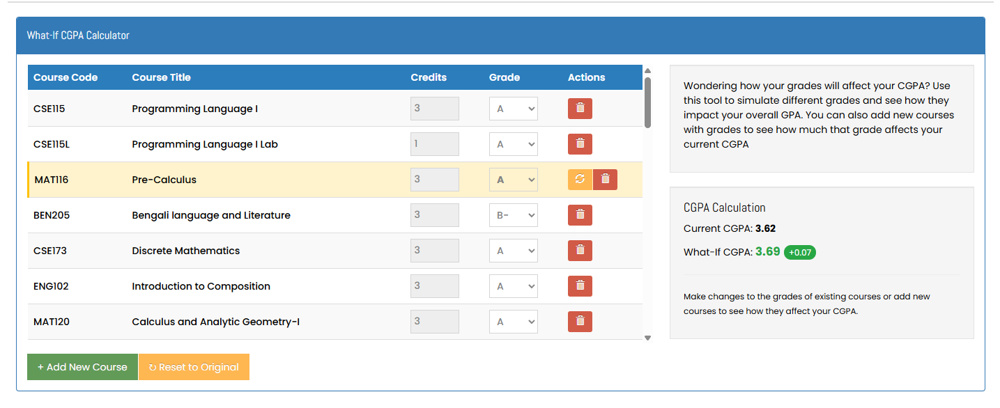
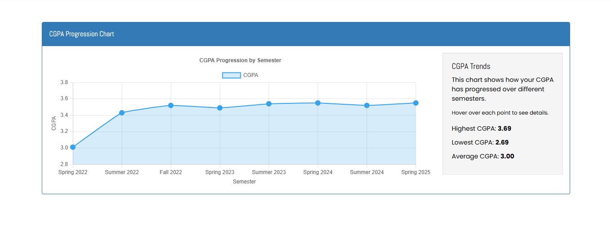

# NSU-RDS-Buddy-extension

A Chrome extension that enhances the North South University (NSU) Results & Data Services (RDS) portal with additional features to help students manage their academic records, analyze performance trends, and plan for future semesters.

## Screenshots

### What-If CGPA Calculator

_The What-If Calculator allows you to simulate grade changes and immediately see the impact on your CGPA_

### CGPA Progression Chart

_Track your academic performance over time with the interactive CGPA progression chart_

## Features

### 1. What-If CGPA Calculator

Calculate how future or hypothetical grades would impact your CGPA.

- Change grades for existing courses to see immediate CGPA impact
- Add new courses with hypothetical grades
- Reset individual courses to original grades
- View impact with color-coded indicators showing improvement or decline
- Global reset function to revert all changes

### 2. CGPA Progression Chart

Visualize your academic performance over time.

- Interactive line chart displaying CGPA progression by semester
- Detailed tooltips showing semester GPA, course count, and credits
- Automatically highlights key statistics (highest, lowest, average CGPA)

## Installation

### From Chrome Web Store (Recommended)

1. Go to [Chrome Web Store](#) _(Link to be added when published)_
2. Click "Add to Chrome"
3. Follow the prompts to install

### Manual Installation (Developer Mode)

1. Download or clone this repository
2. Open Chrome and go to `chrome://extensions/`
3. Enable "Developer mode" in the top right corner
4. Click "Load unpacked" and select the downloaded folder
5. The extension is now installed and will activate on the NSU RDS portal

## Usage

1. Log in to your NSU RDS account
2. Navigate to your grade history page
3. Scroll to the bottom of the page to see:
   - The What-If CGPA Calculator
   - CGPA Progression Chart

### Using the What-If Calculator

- Change grades using the dropdown menus to see immediate CGPA impact
- Click the "+" button to add hypothetical new courses
- Use the reset button (↻) next to modified courses to revert individual changes
- Use the global "Reset to Original" button to clear all changes

### Using the CGPA Chart

- Hover over data points to see detailed semester information
- View summary statistics on the right side of the chart

## Privacy

This extension:

- Operates entirely within your browser
- Does not collect or transmit any personal data
- Does not store your academic records on any external servers
- Uses local storage only for saving your what-if scenarios between sessions

## Development

### Technologies Used

- JavaScript
- HTML/CSS
- Chart.js for data visualization
- Chrome Extension APIs

### Project Structure

- `manifest.json`: Extension configuration
- `content-script.js`: Main functionality that runs on the RDS page
- `background.js`: Background script for extension management
- `popup.html`/`popup.js`: Extension popup interface
- `styles/`: CSS stylesheets
- `libs/`: Third-party libraries
- `icons/`: Extension icons

## Contributing

Contributions are welcome! If you'd like to improve the extension:

1. Fork the repository
2. Create a feature branch (`git checkout -b feature/amazing-feature`)
3. Commit your changes (`git commit -m 'Add some amazing feature'`)
4. Push to the branch (`git push origin feature/amazing-feature`)
5. Open a Pull Request

## License

This project is licensed under the MIT License - see the LICENSE file for details.

## Author

- **Fuwad Hasan** - _Initial work_

## Acknowledgments

- TBA
