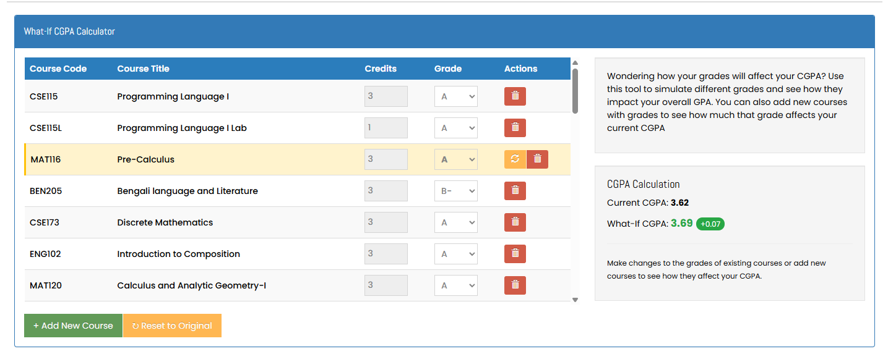
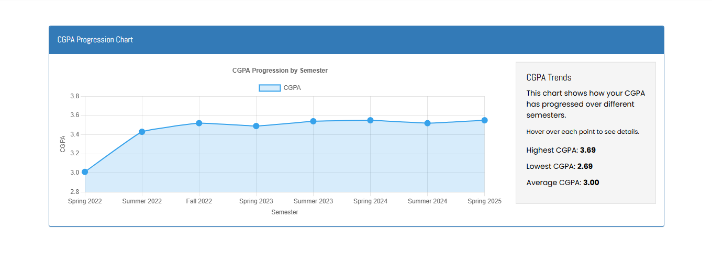

# NSU-RDS-Buddy-extension

A Chrome extension that enhances the North South University (NSU) RDS portal with additional features to help students manage their academic records, analyze performance trends, and plan for future semesters.

## Screenshots

### What-If CGPA Calculator

_The What-If Calculator allows you to simulate grade changes and immediately see the impact on your CGPA_

### Academic Performance Insights

_Multiple chart views — track CGPA progression, grade distribution, credit load, faculty stats, and more_

## Features

### 1. What-If CGPA Calculator

Calculate how future or hypothetical grades would impact your CGPA.

- Change grades for existing courses to see immediate CGPA impact
- Add new courses with hypothetical grades (modal supports `Esc` to close, click-outside to dismiss, auto-focus on first field)
- Reset individual courses to original grades, or remove them entirely with the trash button
- Color-coded delta badge shows improvement (green) or decline (red) at a glance
- Global "Reset to Original" button to revert all changes
- Supports the full NSU grade scale: `A`, `A-`, `B+`, `B`, `B-`, `C+`, `C`, `C-`, `D+`, `D`, `F`, plus `W`, `I`, and `X` (which don't contribute to CGPA)

### 2. Academic Performance Insights

A multi-tab analytics panel with seven different views of your academic data. The summary on the right updates with stats relevant to the active tab.

- **CGPA & Semester GPA** — line chart comparing cumulative GPA against per-semester GPA
- **CGPA** — focused view of CGPA progression with a filled area
- **Semester GPA** — focused view of per-semester GPA, including best and worst semesters
- **Grade Distribution** — doughnut chart showing the share of each grade you've earned, with hover tooltips for percentages
- **Credit Load** — bar chart of credits taken per semester (catches overload/underload patterns)
- **Grade Heatmap** — a transcript-at-a-glance grid: each row is a semester, each course is a colored tile labeled with code and grade
- **Faculty Grades** — horizontal bar chart of average GPA earned per faculty, sorted highest-first; tooltip lists every course you took with each faculty

## Installation

### From Chrome Web Store (Recommended)

1. Go to [Chrome Web Store](#) _(Link to be added when published)_
2. Click "Add to Chrome"
3. Follow the prompts to install

### Manual Installation (Developer Mode)

1. Download or clone this repository
2. Open Chrome and go to `chrome://extensions/`
3. Enable "Developer mode" in the top right corner
4. Click "Load unpacked" and select the downloaded folder
5. The extension is now installed and will activate on the NSU RDS portal

## Usage

1. Log in to your NSU RDS account
2. Navigate to your grade history page
3. Scroll to the bottom of the page to see:
   - The What-If CGPA Calculator
   - Academic Performance Insights (multi-tab chart panel)

### Using the What-If Calculator

- Change grades using the dropdown menus to see immediate CGPA impact
- Click "+ Add New Course" to add a hypothetical course (the modal accepts `Esc` to close)
- Use the reset button (↻) next to modified courses to revert individual grade changes
- Use the trash button (🗑) to remove a course from the calculation
- Use the global "Reset to Original" button to clear all changes

### Using Academic Performance Insights

- Switch between tabs (CGPA & Semester GPA, CGPA, Semester GPA, Grade Distribution, Credit Load, Grade Heatmap, Faculty Grades) using the toggle in the panel header
- Hover over data points, bars, slices, or heatmap tiles for detailed information
- The summary panel on the right updates contextually to the active tab — showing things like best/worst semester, total credits, most common grade, top faculty, etc.

## Privacy

This extension:

- Operates entirely within your browser
- Does not collect or transmit any personal data
- Does not store your academic records on any external servers
- All what-if calculations are scoped to the current page session

## Development

### Technologies Used

- JavaScript
- HTML/CSS
- Chart.js for data visualization
- Chrome Extension APIs

### Project Structure

- `manifest.json`: Extension configuration
- `content-script.js`: Main functionality that runs on the RDS page
- `popup.html`/`popup.js`: Extension popup interface
- `styles/`: CSS stylesheets
- `libs/`: Third-party libraries
- `icons/`: Extension icons

## Contributing

Contributions are welcome! If you'd like to improve the extension:

1. Fork the repository
2. Create a feature branch (`git checkout -b feature/amazing-feature`)
3. Commit your changes (`git commit -m 'Add some amazing feature'`)
4. Push to the branch (`git push origin feature/amazing-feature`)
5. Open a Pull Request

## License

This project is licensed under the MIT License - see the LICENSE file for details.

## Author

- **Fuwad Hasan** - _Initial work_

## Acknowledgments

- TBA
